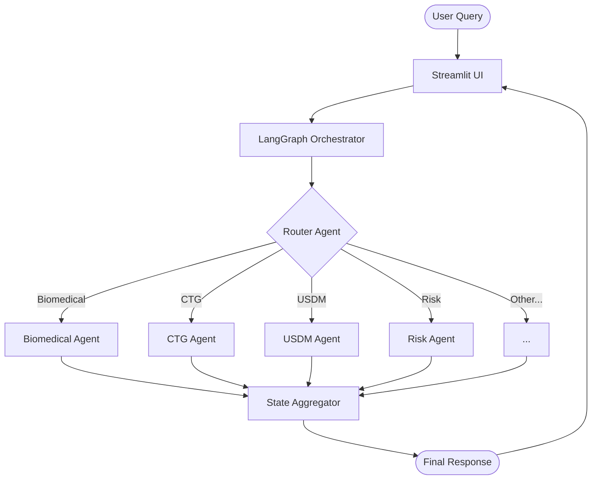

# 🏗 Architecture & System Design

ClinOps AI is architected as a **Multi-Agent Orchestration System** using a Hub-and-Spoke model. It leverages LangGraph to manage stateful, multi-turn interactions between specialized expert agents.

## 🕸️ High-Level Orchestration

The system follows a directed graph workflow where the **Question Categorizer** acts as the central router.

## 🧱 Layered Architecture

### 1. Core Services Layer (`src/core/`)
- **`config.py`**: A robust configuration management system using Pydantic V2. It handles environment variable validation and provides type-safe access to Azure settings.
- **`llm_client.py`**: A singleton implementation of the Azure OpenAI interface. It ensures a single connection instance is shared across all agents to optimize resource usage.
- **`logger.py`**: Structured logging for debugging and audit trails.

### 2. Agent Ecosystem (`src/agents/`)
- **`base_agent.py`**: An abstract base class (`BaseAgent`) that encapsulates the logic for LLM communication, history management, and system prompt injection.
- **`question_categorizer_agent.py`**: A specialized agent that uses semantic reasoning to classify user intent into predefined clinical operations domains.
- **`clinical_experts.py`**: A collection of domain-specific experts. Each agent is defined by a unique system prompt and specialized logic (e.g., USDM formatting, Risk assessment).

### 3. Orchestration Layer (`src/orchestration/`)
- **`state.py`**: Defines the `AgentState` TypedDict. This "shared memory" travels through the graph, accumulating outputs from various agents.
- **`workflow.py`**: Defines the LangGraph structure. It maps nodes to agent processes and defines conditional edges based on the router's decision.

### 4. UI Layer (`src/ui/`)
- **`app.py`**: The entry point for the Streamlit application. It manages the session state and invokes the LangGraph workflow.
- **`components.py`**: Contains premium CSS styling and reusable UI components (header, sidebar, agent cards).

## 📊 State Management

The `AgentState` is the backbone of the orchestration. It tracks:
- `user_query`: The original input.
- `next_agent`: The decision made by the router.
- `history`: A list of message exchanges for context-aware responses.
- `final_response`: The combined output delivered to the user.

## 🔐 Security & Reliability
- **Environment Isolation**: All sensitive keys are managed via `.env` files and never hardcoded.
- **Error Handling**: Every agent execution is wrapped in try-except blocks with detailed logging to prevent system crashes during orchestration.
- **Type Safety**: Extensive use of Python type hints and Pydantic validation.
